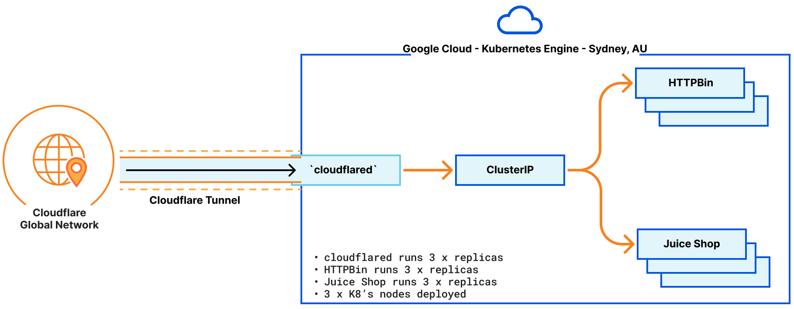

# Cloudflare Tunnel running on Kubernetes

This demo will deploy a Cloudflare Tunnel for high availability onto a 3 node Kubernetes Cluster that hosts deployments of [HTTPBin](https://httpbin.org/) and [Juice Shop](https://owasp.org/www-project-juice-shop/).

Skip to the sections as follows:

- [Kubernetes Cluster Setup](#initial-kubernetes-cluster-setup)
- [Deploy Cloudflare Tunnel](#deploy-cloudflare-tunnel-replicas)
- [Misc](#misc)

The Cloudflare Tunnel deployment will be a 3 x node replica, and the architecture deployed is as follows:



## Pre-Requisites

The following pre-requisites apply:

- [Setup DNS Zone](https://developers.cloudflare.com/dns/zone-setups/full-setup/setup/) registered with Cloudflare
- Download and install [Cloudflare Tunnel](https://developers.cloudflare.com/cloudflare-one/connections/connect-networks/downloads/) onto your workstation
- Kubernetes Cluster either in a Cloud Environment, or on-premises

# Initial Kubernetes Cluster Setup

If you don't already have a K8's cluster to go, follow the steps below to create a vanilla K8s cluster on GCP using the [`gcloud`](https://cloud.google.com/sdk/gcloud) CLI.

```shell
gcloud container clusters create tsangha-k8s-cluster --num-nodes=3 --machine-type "e2-small" \
                --zone "australia-southeast1-a" --labels=owner=tsangha --network=anz-se-vpc \
                --subnetwork=anz-se-vpc

gcloud container clusters get-credentials tsangha-k8s-cluster --zone australia-southeast1-a
```

List the Kubernetes nodes and services, using `kubectl`:

```shell
kubectl get nodes
NAME                                                 STATUS   ROLES    AGE    VERSION
gke-tsangha-k8s-cluster-default-pool-b0c8898c-5w4x   Ready    <none>   8m4s   v1.27.3-gke.100
gke-tsangha-k8s-cluster-default-pool-b0c8898c-dhqq   Ready    <none>   8m4s   v1.27.3-gke.100
gke-tsangha-k8s-cluster-default-pool-b0c8898c-jn0w   Ready    <none>   8m4s   v1.27.3-gke.100

kubectl get services
NAME         TYPE        CLUSTER-IP   EXTERNAL-IP   PORT(S)   AGE
kubernetes   ClusterIP   10.60.0.1    <none>        443/TCP   10m
```

## Deploy HTTPBin and Juice Shop

Deploy the HTTBin and Juice Shop deployments, which are contained in the following files:

```shell
.
├── httpbin.yaml
└── juiceshop.yaml
```

Both of these deployments create three replicas and deploy a service to expose the application on specific ports via the Cluster IP. Deploy as follows:

```shell
kubectl apply -f httpbin.yaml
kubectl apply -f juiceshop.yaml
```

Once applied run `kubectl` to get deployment and services configuration as follows:

```shell
kubectl get deployments
NAME        READY   UP-TO-DATE   AVAILABLE   AGE
httpbin     3/3     3            3           2m46s
juiceshop   3/3     3            3           2m18s

kubectl get services
NAME                TYPE        CLUSTER-IP    EXTERNAL-IP   PORT(S)    AGE
httpbin-service     ClusterIP   10.60.9.186   <none>        80/TCP     2m48s
juiceshop-service   ClusterIP   10.60.9.20    <none>        3000/TCP   2m20s
kubernetes          ClusterIP   10.60.0.1     <none>        443/TCP    30m
```

# Deploy Cloudflare Tunnel Replicas

The following section will create a tunnel replica that share's the same config file, and credential files which are stored as a secret in the K8's cluster. This is an abbreviated method of a [Locally-managed tunnel](https://developers.cloudflare.com/cloudflare-one/connections/connect-networks/configure-tunnels/local-management/) specifically for a K8s cluster.

## Instantiate a tunnel

1. Create a Cloudflare Tunnel `cert.pem` file from the workstation where you installed `cloudflared` as per the [pre-reqs](#pre-requisites):

```shell
cloudflared tunnel login
/Users/tsangha/.cloudflared/cert.pem
```

2. Create the tunnel with a name, which creates a JSON file

```shell
cloudflared tunnel create kubernetes-cluster

Tunnel credentials written to /Users/tsangha/.cloudflared/e55e36c4-8274-48df-9332-b9d80cef694c.json. cloudflared chose this file based on where your origin certificate was found. Keep this file secret. To revoke these credentials, delete the tunnel.

Created tunnel kubernetes-cluster with id e55e36c4-8274-48df-9332-b9d80cef694c
```

Once the tunnel configuration is created, you'll have a JSON file similar to:

```shell
cat ~/.cloudflared/e55e36c4-8274-48df-9332-b9d80cef694c.json | jq
{
  "AccountTag": "XXXXXXXXXXXXXX",
  "TunnelSecret": "XXXXXXXXXXXXXXXXXXXXXXXX",
  "TunnelID": "e55e36c4-8274-48df-9332-b9d80cef694c"
}
```

&nbsp;

> [!TIP]
> To retrieve the tunnel ID, execute the following cmd: `cloudflared tunnel list`

&nbsp;

3. Upload the newly created JSON file with tunnel credentials to K8s

```shell
kubectl create secret generic \
        cloudflare-tunnel-credentials \
        --from-file=/Users/tsangha/.cloudflared/e55e36c4-8274-48df-9332-b9d80cef694c.json
```

4. Modify the `cloudflared.yaml` to match your specific environment

Now that we've got the credentials created and uploaded, the last remaining step to deploy the tunnel is to modify the `cloudflared.yaml` file to match your environment.

Specifically the `ConfigMap` section needs to be updated. The first part of the file that needs to be updated is the credentials file, and the ingress paths to your services.

&nbsp;

> [!NOTE]
>
> - Only change the json filename in the `credentials-file:` path
> - The `service` points to the cluster IP and Port of each service - `kubectl get services`

&nbsp;

```yaml
credentials-file: /etc/cloudflared/creds/e55e36c4-8274-48df-9332-b9d80cef694c.json

ingress:
  - hostname: juiceshop.tonysangha.com
    service: http://10.60.9.20:3000
  - hostname: httpbin.tonysangha.com
    service: http://10.60.9.186:80
```

Deploy the tunnel configuration with the command: `kubectl apply -f cloudflared.yaml`.

Retrieving the latest deployments, you should see something similar to:

```shell
kubectl get deployments
NAME          READY   UP-TO-DATE   AVAILABLE   AGE
cloudflared   0/3     3            0           10s
httpbin       3/3     3            3           13m
juiceshop     3/3     3            3           13m
```

You can also confirm your tunnel has 3 x connections back to Cloudflare by running: `cloudflared tunnel info TUNNEL_ID`

```shell
cloudflared tunnel info e55e36c4-8274-48df-9332-b9d80cef694c
NAME:     kubernetes-cluster
ID:       e55e36c4-8274-48df-9332-b9d80cef694c
CREATED:  2024-01-15 04:14:23.690055 +0000 UTC

CONNECTOR ID                         CREATED              ARCHITECTURE VERSION  ORIGIN IP      EDGE
5f2baa17-1656-4ad2-95dc-f07cfa9ac588 2024-01-15T04:37:12Z linux_amd64  2024.1.2 34.151.122.123 2xkul01, 2xsyd01
620c9185-9e2b-47b6-a9cb-35a7af48cab4 2024-01-15T04:37:13Z linux_amd64  2024.1.2 35.197.162.46  2xkul01, 2xsyd06
a3f92765-8f77-4f01-97cb-d39ed6997c33 2024-01-15T04:37:13Z linux_amd64  2024.1.2 35.201.7.199   2xkul01, 2xsyd06
```

5. Create DNS records to point to your tunnel

The last remaining step to publish these connections to the public, is to map DNS records to specific tunnel, which can be done using the `cloudflared` cli tool. The two records we will create are as follows:

```shell
cloudflared tunnel route dns e55e36c4-8274-48df-9332-b9d80cef694c httpbin.tonysangha.com
2024-01-15T04:52:02Z INF Added CNAME httpbin.tonysangha.com which will route to this tunnel tunnelID=e55e36c4-8274-48df-9332-b9d80cef694c

cloudflared tunnel route dns e55e36c4-8274-48df-9332-b9d80cef694c juiceshop.tonysangha.com
2024-01-15T04:52:08Z INF Added CNAME juiceshop.tonysangha.com which will route to this tunnel tunnelID=e55e36c4-8274-48df-9332-b9d80cef694c
```

# Misc

Check logs of `cloudflared` deployment:

```shell
kubectl logs $(kubectl get pod -l app=cloudflared -o jsonpath="{.items[0].metadata.name}")
```

Remove the K8s cluster

```shell
gcloud container clusters delete tsangha-k8s-cluster --zone australia-southeast1-a
```
