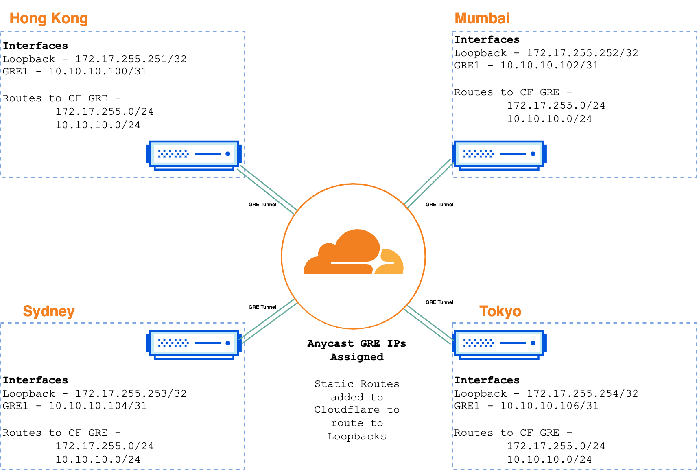
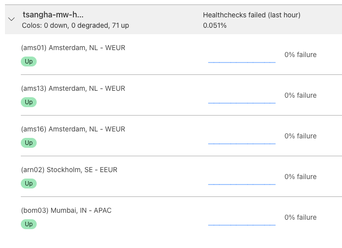

# Magic WAN - GRE

This lab environment will automate the creation of a four site Magic WAN topology using GRE encapsulation as per the diagram below:

Each site has a Loopback adapter that's designed to mimic a LAN interface, and the network addresses will be used to create static routes in Cloudflare's Magic WAN configuration. The table below lists all the specific IP addresses used.

| Site      | Loopback Adapter  |  GRE Tunnel VM IP  | GRE Tunnel CF IP |
| :-------- | :---------------: | :-------------: | :-----------: |
| Hong Kong | 172.17.255.251/32 | 10.10.10.100/31 | 10.10.10.101  |
| Mumbai    | 172.17.255.252/32 | 10.10.10.102/31 | 10.10.10.103  |
| Sydney    | 172.17.255.253/32 | 10.10.10.104/31 | 10.10.10.105  |
| Tokyo     | 172.17.255.254/32 | 10.10.10.106/31 | 10.10.10.107  |

## Automation

This lab is automated end to end using Terraform with configuration being done at Cloudflare, IaaS (GCP) and VM layers. The specifics of the automation are as follows:

- Create four VMs in separate GCP regions using the [Standard Network Tier](https://cloud.google.com/network-tiers)
- Configure GCP VPC Firewall Rules to only allow GRE ingress/egress to [Cloudflare IPs](https://www.cloudflare.com/en-gb/ips/)
- Configure [GRE Tunnel Endpoints](https://developers.cloudflare.com/magic-wan/configuration/manually/how-to/configure-tunnels/) in Cloudflare
- Configure [Static Routes](https://developers.cloudflare.com/magic-wan/configuration/manually/how-to/configure-static-routes/) in Cloudflare
- Automate the configuration of Ubuntu 24.04 LTS VM's

# Lab Environment

Below is a list of useful commands to validate VMs can ping each other, and perform packet captures. 

- `whereami` - Confirm Public IP information using IP data
- `showtunnel` - Show GRE Tunnel Details
- `showicmp` - Perform TCP Dump on GRE Interface to show incoming packets from other sites
- Capture Health Check ICMP Echo Replies only - `sudo tcpdump -i any 'icmp[icmptype] == 0 and not (net 172.17.255.0/24 or net 10.10.10.0/24)'`

## Deploying in your own environment

Prior to deployment, ensure the following pre-reqs have been met:

## Pre-Requisites

- Must have Terraform available locally
- Must have Magic WAN enabled on your Cloudflare account
- Must have at least 1 x Anycast IP assigned to your account by Cloudflare
- Must have access to GCP to deploy VMs to (configurable)

### Deployment

- Copy the `terraform.tfvars.example` to `terraform.tfvars`
- Add missing variables for your environment, lines `1 - 9`
- Deploy lab using command `terraform apply`
- Destroy lab using command `terraform destroy`

Once the deployment has succeeded you can `ping` from one VM to anothers loopback, and all health checks should also display as healthy in Cloudflare's Dashboard. 

